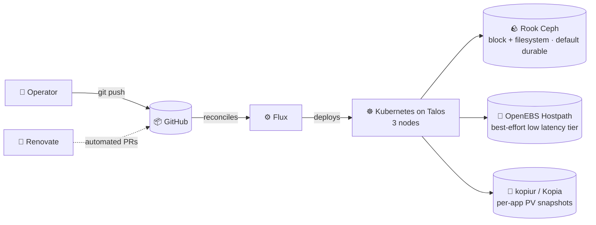
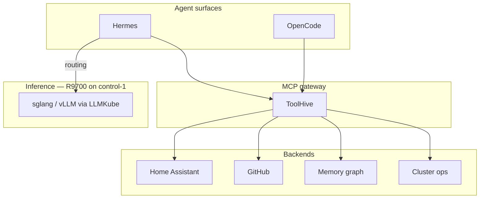

# Cluster

**GitOps** with Flux · **Self-hosted by design**

 

&nbsp;&nbsp;
&nbsp;&nbsp;
&nbsp;&nbsp;

 

&nbsp;&nbsp;
&nbsp;&nbsp;
&nbsp;&nbsp;
&nbsp;&nbsp;
&nbsp;&nbsp;
&nbsp;&nbsp;

---

## 📖 Overview

This is my live configuration for a 3-node Talos Linux cluster. Every change lands in Git first;
Flux reconciles the cluster from there, and Renovate keeps images and charts current via PRs.

The repo is GitOps-strict: applications are declared as `HelmRelease`
resources, all secrets live in SOPS-encrypted manifests.

The cluster is operated by me; agents are tools in that loop. I make
use of agentic workflows: agent-authored PRs, automated review and
skill-driven operations, nothing goes live without me deciding it should.

---

## 🗺️ Architecture

Storage classes are picked per workload by durability requirement: Ceph for
anything that must survive node loss, OpenEBS Hostpath for throwaway state
or replicated data where performance is critical (e.g. postgres).

---

## 🧰 Stack at a glance

| Layer           | Tool                           | Role                                     |
|-----------------|--------------------------------|------------------------------------------|
| **OS**          | Talos Linux                    | Immutable control-plane + worker OS      |
| **Kubernetes**  | v1.x (see badges)              | 3 nodes, all control-plane + worker      |
| **GitOps**      | Flux 2                         | Declarative cluster reconciliation       |
| **Automation**  | Renovate + GitHub Actions      | Dependency PRs, lint, scans              |
| **CNI**         | Cilium (eBPF)                  | Networking, network policies, LoadBalancer |
| **Ingress**     | Envoy Gateway + k8s-gateway    | L7 gateway / HTTPRoute                   |
| **Tunnel**      | cloudflared                    | Public ingress without exposing home WAN |
| **DNS**         | external-dns                   | Record sync                              |
| **TLS**         | cert-manager                   | Certificate lifecycle                    |
| **GPU**         | AMD R9700 (full passthrough)   | LLM inference on control-1               |
| **Storage**     | Rook-Ceph, OpenEBS Hostpath    | Tiered by durability requirement         |
| **Databases**   | CloudNative-PG, Dragonfly      | Postgres clusters, in-memory store       |
| **Secrets**     | SOPS + age                     | Encrypted manifests, zero plain-text     |
| **Backups**     | kopiur (Kopia-native)          | Per-app PV snapshots + restores          |
| **Observability** | prometheus-operator, Grafana, Gatus, Victoria* | Metrics, dashboards, uptime |

---

## 🖥️ Hardware

| Role      | Host        | CPU                     | RAM          | GPU                                  | Network              | Storage                                        |
|-----------|-------------|-------------------------|--------------|--------------------------------------|----------------------|------------------------------------------------|
| control-1 | TrueNAS VM  | Ryzen 5800X → 6 cores   | 64 GB (of 128) | AMD Radeon AI PRO R9700 — full passthrough | 10G NIC (running 2.5 Gbps) | Samsung PM983 1.92 TB NVMe (boot 500 GB · Ceph 800 GB) |
| control-2 | Chuwi UBox  | Ryzen 6600H (6 cores)   | 32 GB DDR5   | Radeon 660M (APU)                    | 2× 2.5G (1 used)     | Boot Micron 7450 Pro 480 GB · Ceph Samsung 980 Pro 1 TB |
| control-3 | Chuwi UBox  | Ryzen 6600H (6 cores)   | 32 GB DDR5   | Radeon 660M (APU)                    | 2× 2.5G (1 used)     | Boot Micron 7450 Pro 480 GB · Ceph Micron 7450 Pro 960 GB |

All nodes are control-plane *and* worker nodes; the R9700 on control-1 is the dedicated inference GPU.
Drive details, PLP and write-cache policy: [docs/drives.md](docs/drives.md).

---

## 📦 What's running

🤖 <b>AI & Agents</b> — local agent fleet + inference (namespace <code>ai/</code>)

| App          | Purpose                                                    |
|--------------|------------------------------------------------------------|
| **Hermes**   | Autonomous agentic harness                                 |
| **OpenCode** | CLI coding agent for repo work                             |
| **ToolHive** | Unified MCP server gateway                                 |
| **LiteLLM**  | LLM proxy / routing layer                                  |
| **OmniRoute**| LLM routing                                                |
| **LLMKube**  | K8s-native LLM model management (sglang/vLLM/llama.cpp)    |
| **Memini**   | Long-term memory for agents                                |

Tuning constraints and benchmark history for the inference stack live in
[`docs/llm-hosting/`](docs/llm-hosting/).

🎬 <b>Media</b> — *arr stack, Jellyfin, theming & library tooling (namespace <code>media/</code>)

Radarr · Sonarr · Prowlarr · qBittorrent · Seerr · Jellyfin ·
Jellystat · Wizarr · Bazarr · Recyclarr · CleanRR · DedupArr ·
Unpackerr · FlareSolverr · BRRPolice · FileFlows · Qui

🏠 <b>Personal & utilities</b> (namespace <code>default/</code>)

Nextcloud · Homepage (overview) · Karakeep · Change Detection · SearXNG ·
Ghostfolio · IT-Tools · PicoShare · Obico · DumbAssets · Spoolman

🌐 <b>Network & edge</b> (namespace <code>network/</code>)

Cloudflared (tunnel) · Envoy Gateway (L7) · k8s-gateway (L4) · external-dns ·
External-Service · SMTP-Relay

🔭 <b>Observability & autoscaling</b> (namespace <code>observability/</code>)

Prometheus Operator + CRDs · Grafana · Gatus (uptime) · Siren ·
VictoriaMetrics · VictoriaLogs · KEDA (event-driven scaling) ·
kube-state-metrics · Kromgo (cluster stats badges) · Silence-operator ·
custom exporters

🗄️ <b>Databases</b> (namespace <code>database/</code>)

CloudNative-PG (Postgres clusters with WAL archiving) · Dragonfly (Redis-compatible)

🛡️ <b>Security</b> (namespace <code>security/</code>)

CrowdSec (fail2ban-style intrusion detection) · KGuardian (network policy
enforcement) · Trivy-Operator (image & CVE scanning)

⛓️ <b>System & platform</b> (namespaces <code>kube-system/</code>, <code>flux-system/</code>, …)

Cilium · CoreDNS · Spegel (local path) · descheduler · etcd-defrag ·
metrics-server · reloader · snapshot-controller · node-problem-detector ·
generic-device-plugin · AMD GPU undervolt · actions-runner-controller (self-hosted
GitHub runners) · Flux · Rook-Ceph · OpenEBS · cert-manager ·
kopiur (backup machinery) · system-upgrade (Talos upgrades)

---

## 🧠 AI stack

Local-first: agents run *on* the cluster and reach it *through* a gated MCP
gateway — no cloud LLM in the loop by default.

- **Inference** runs on the R9700 passthrough; model staging, tuning
  constraints, and benchmark history: [`docs/llm-hosting/`](docs/llm-hosting/).
- **ToolHive** is the single MCP surface for all agents; one gateway instead of per-app MCP sprawl.
- **Memini** gives agents long-term memory that persists across sessions and clients.

---

## 🛡️ Operational pillars

### 🌪️ Strict GitOps

Every change reaches the cluster through Git. Flux suspends are a deliberate
manual signal — a paused Kustomization is not "broken", it's an in-flight
maintenance pause, and it is not reverted on sight.

### 🤖 Agent-readable conventions

Operational knowledge lives where agents load it: [AGENTS.md](AGENTS.md)
(three-tier safety model: always / ask-first / never),
[.agents/learned-preferences.md](.agents/learned-preferences.md) and
[.agents/learned-workspace.md](.agents/learned-workspace.md) (maintained by
continual learning), and
[.agents/skills/](.agents/skills) — one `SKILL.md` per workflow:
add-app-to-cluster, backup-restore, debug-cluster, git-worktree-isolation,
k8s-at-home-research, pr-review, prometheus-cluster-health, handoff.

### 💾 Backups — per-app, Kopia-native

kopiur (migrated 2026-07-12) declares a `SnapshotPolicy` + `SnapshotSchedule`
per app; restores are passive (`dataSourceRef`-triggered) and documented in
[docs/kopiur-restore.md](docs/kopiur-restore.md).

### 🔭 Observability

Prometheus Operator scrapes the fleet; Grafana dashboards, Gatus uptime,
VictoriaMetrics/Logs for long retention, KEDA for scale-to-zero workloads, and
Kromgo feeds the live badges at the top of this file.

### 🛟 CI

GitHub Actions workflows live in [`.github/workflows/`](.github/workflows/).

---

## 📚 Documentation

| Doc                       | What it's for                              |
|---------------------------|--------------------------------------------|
| [Useful commands](docs/useful_commands.md) | flux / just / talos / sops reference + app runbooks |
| [LLM hosting](docs/llm-hosting/) | sglang/vLLM tuning constraints + benchmark history |
| [Storage benchmarks](docs/storage_benchmarks.md) | measured storage-class performance |
| [Kopiur restore](docs/kopiur-restore.md) | backup/restore procedure |
| [Database](docs/database/) | database operations |
| [XMRig solar mining](docs/xmrig-solar-mining.md) | solar-powered mining setup |

Repo layout: `kubernetes/` (manifests) · `talos/` (machine configuration) ·
`docs/` (runbooks) · `.agents/` (task-specific guidance) ·
[`.justfile`](.justfile) + [`.mise.toml`](.mise.toml) (tooling).

---

## 🙏 Acknowledgements

Based on the excellent [cluster-template](https://github.com/onedr0p/cluster-template)
by [@onedr0p](https://github.com/onedr0p) — thank you and the community for
the foundation this cluster was built on.

Continuously reconciling since <b>April 2021</b>.

